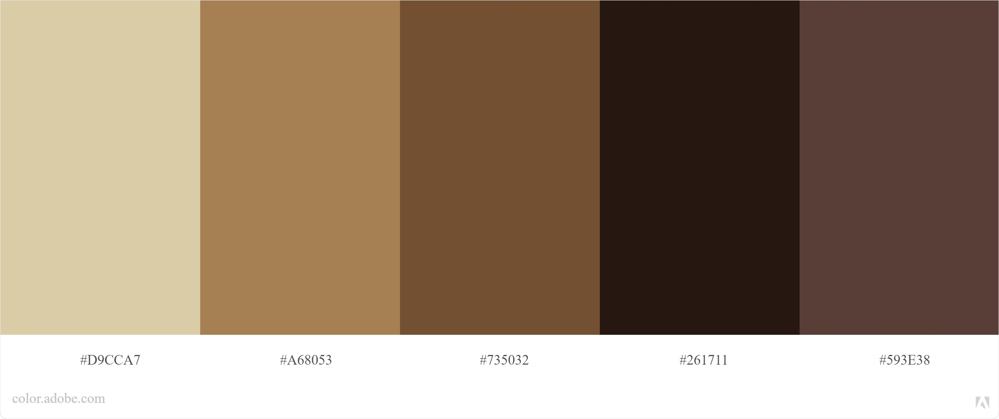

# **Sejam Bem-vindos a Evolution Drinks**

- [Conceito](#conceito)
- [Como Iniciar a Aplicação](#como-iniciar-a-aplicação)
- [Pontos de melhoria](#vamos-praticar)

# **Conceito**

O nome Evolution Drinks é idealizado a partir da distribuidora `@evolution.adega`, com a proposta de preencher seu portfólio de produtos e levar conhecimento sobre drinks para os seus clientes.
 
A aplicação foi construída utilizando a API [TheCockTailDB](https://www.thecocktaildb.com/api.php), onde é possível obter receitas de Drinks e quais os são os ingredientes usados para a mesma.

Para consumir a API, foi utilizado a biblioteca `axios`, optei em utiliza-la, por sua facilidade em consumir novos endpoints e fazer conversão em `JSON` automática. 

Os endpoints que estão sendo consumidos ao iniciar a aplicação, os retornos estão sendo armazenados no estado global da ContextAPI, e utilizados pelo componente `ShowDrinks.jsx`, os demais endpoints que foram necessários a utilização, estão sendo armazenados no estado local do próprio componente que faz o request, pois os retornos são acessados no próprio componente ou por seu componente filho.

O layout foi construido com o auxilio dos frameworks [Bootstrap](https://react-bootstrap.netlify.app/) e o [MUI](https://mui.com/), tendo como base a seguinte paleta de cores:

 
 
 

# **Como Iniciar a Aplicação**

Link : https://evolution-drinks.vercel.app/

Assim que você acessar o site, irá cair na nossa rota '`/`', nossa Home, nela é possível desfrutar de vários drinks que já estão presentes ao entrar, clicando em `Mais Informações` nos drinks, você é redirecionado para a página de receita do mesmo, logo após, vemos os ingredientes necessários e suas medidas para fazer tal drink, e logo abaixo da foto do drink, vemos uma pequena instrução em inglês de como executar.

 
Caso queira pesquisar um novo drink que não esteja na lista inicial, você pode usufruir do campo de busca, clicando em `Home` no cabeçalho, você será redirecionado para a página inicial, nela estará o campo de busca, sinta-se à vontade e procure o drink que tenha interesse. É possível pesquisar drinks que utilizam o mesmo ingrediente, clicando no item de escolha.

Se não souber oque pesquisar, tudo bem! Basta clicar em Pesquisar no campo de texto, que voce sera redirecionado para uma nova pagina, onde é possivel pesquisar pelas letras inicias de cada Drink, não é bacana?

 
 

# Pontos de melhoria

 - Implementar os testes, utilizando a `React Testing Library`;
 - Melhoria na responsividade;